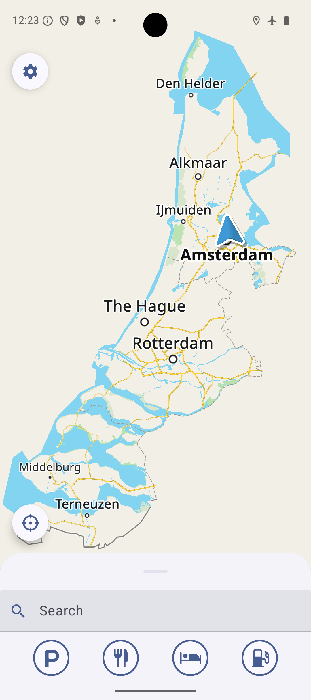
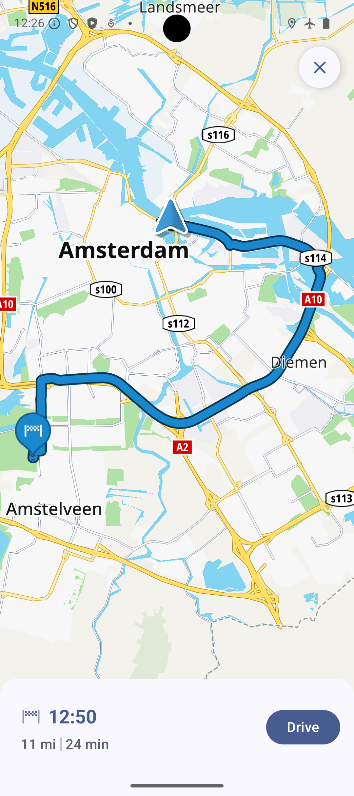

# Usage Example: Testing Offline Maps using Online navigation with offline fallback

You can test the offline maps to ensure you can navigate without an internet connection!

The app comes with a pre-downloaded offline map of an area in Amsterdam that you can use without any internet connectivity, making it perfect for testing the Online First mode.

Follow these steps to ensure everything works seamlessly:

## Launch the Application

Start the app, and on the startup popup, select the Online First mode.

## Simulate Offline Mode

Enable Airplane Mode on your device to simulate a scenario where no new map data can be fetched from online services. This ensures the app operates exclusively with the pre-downloaded offline maps.

## Navigate to the Offline Map Area

Move to the location where the offline maps have been downloaded. Navigate to the Amsterdan region within your app and zoom out to see the boundaries of the offline map.

## Explore Map Features Offline

Verify that you can view the map of the region in detail using different zoom levels.

Check for Points of Interest (POIs) such as landmarks, restaurants, or gas stations.

Create and simulate routes within the offline map area.

